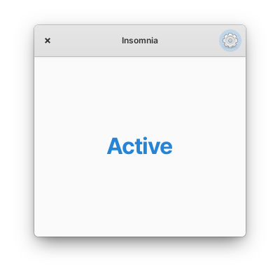
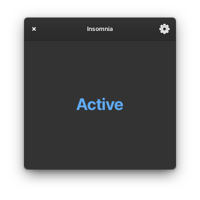
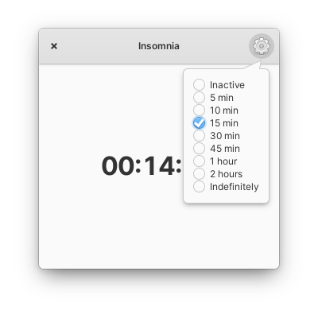
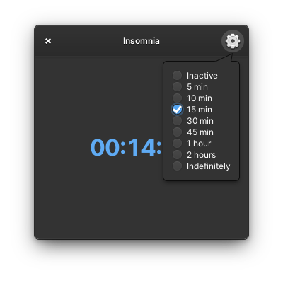
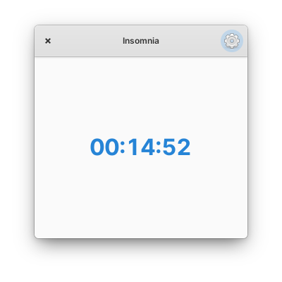

<div align="center">
  <span align="center"> </span>
  <h1 align="center">Insomnia</h1>
  <h3 align="center">Prevent the display from being turned off or the device from going into sleep mode</h3>
  <p align="center">Designed for <a href="https://elementary.io">elementary OS</a></p>
</div>

<p align="center">
  <a href="https://appcenter.elementary.io/com.manexim.insomnia" target="_blank">
    
  </a>
</p>

<p align="center">
  <a href="https://github.com/manexim/insomnia/actions/workflows/main.yml">
    
  </a>
  <a href="https://github.com/manexim/insomnia/releases/">
    
  </a>
  <a href="https://github.com/manexim/insomnia/blob/main/COPYING">
    
  </a>
</p>

<p align="center">
  <table>
    <tr>
      <td>
        
      </td>
      <td>
        
      </td>
    </tr>
    <tr>
      <td>
        
      </td>
      <td>
        
      </td>
    </tr>
    <tr>
      <td>
        
      </td>
      <td>
        
      </td>
    </tr>
  </table>
</p>

## Installation

### Dependencies

These dependencies must be present before building:

-   `libgranite-dev`
-   `libgtk-3-dev`
-   `libhandy-1-dev` >=1.0.0
-   `meson`
-   `valac`

### Building

```
git clone https://github.com/manexim/insomnia.git && cd insomnia
meson build --prefix=/usr
cd build
ninja
sudo ninja install
com.manexim.insomnia
```

### Deconstruct

```
sudo ninja uninstall
```

## Contributing

If you want to contribute to Insomnia and make it better, your help is very welcome.

### How to make a clean pull request

-   Create a personal fork of this project on GitHub.
-   Clone the fork on your local machine. Your remote repo on GitHub is called `origin`.
-   Create a new branch to work on. Branch from `main`!
-   Implement/fix your feature.
-   Push your branch to your fork on GitHub, the remote `origin`.
-   From your fork open a pull request in the correct branch. Target the `main` branch!

And last but not least: Always write your commit messages in the present tense.
Your commit message should describe what the commit, when applied, does to the code – not what you did to the code.

## Special thanks

### Translators

| Name                                               | Language   |
| -------------------------------------------------- | ---------- |
| [Vistaus](https://github.com/Vistaus)              | Dutch 🇳🇱   |
| [NathanBnm](https://github.com/NathanBnm)          | French 🇫🇷  |
| [meisenzahl](https://github.com/meisenzahl)        | German 🇩🇪  |
| [JoseExposito](https://github.com/JoseExposito)    | Spanish 🇪🇸 |
| [youngLights14](https://github.com/youngLights14)  | Serbian 🇷🇸 |
| [asdffdsdaf](https://github.com/asdffdsdaf)        | Russian 🇷🇺 |

## License

This project is licensed under the GNU General Public License v3.0 - see the [COPYING](COPYING) file for details.
